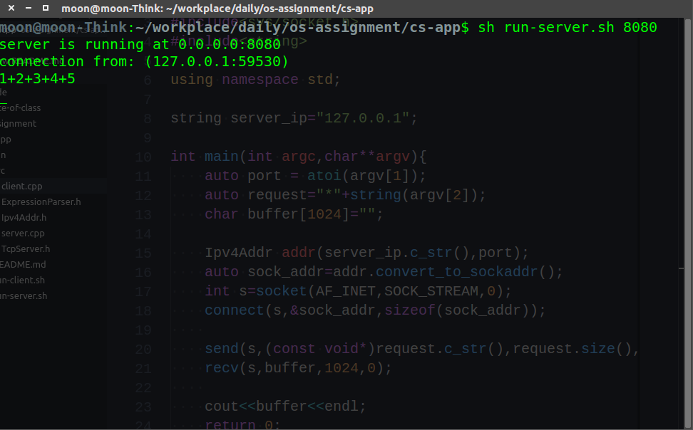
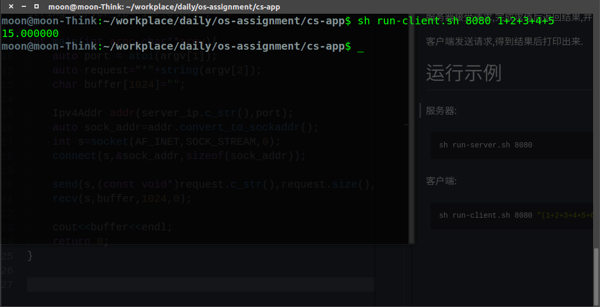

C/S架构的app


# APP说明

简单的算数表达式求值.

服务器接受请求,完成求值后返回结果,并主动关闭链接.

客户端发送请求,得到结果后打印出来.

# 运行示例

本应用适用于Linux,只能在终端下运行.

## 运行方法


服务器:
```bash
sh run-server.sh 8080
```


客户端:
```bash
sh run-client.sh 8080 "(1+2+3+4+5+6+7)*10"
```

## 输出结果
服务器


客户端


# 已知bug

* 非法表达式输入会引起core dump